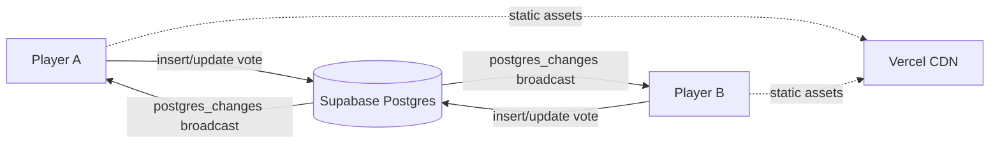

# Planning Poker

Real-time scrum planning poker built with **Next.js 15** + **Supabase Realtime**, ready to deploy on **Vercel**.

- Multi-room (each room has its own URL)
- Real-time vote sync via Supabase Postgres changes
- Switchable decks: Fibonacci, modified Fibonacci, Powers of 2, T-Shirt, or custom
- Emoji-friendly player names
- Average + per-value distribution after reveal
- Dark theme inspired by classic planning poker tools

## 1. Setup Supabase

1. Create a new project at [supabase.com](https://supabase.com).
2. In **SQL Editor**, paste and run [`supabase/schema.sql`](supabase/schema.sql). This creates the `rooms` and `players` tables, enables realtime, and creates RLS policies that let any anonymous user read/write (rooms are public by design — anyone with the room link can play).
3. Go to **Project Settings → API** and copy:
   - `Project URL`
   - `anon` public key

> **Realtime check**: After running the SQL, open **Database → Replication** and confirm `rooms` and `players` are in the `supabase_realtime` publication. The migration adds them automatically, but the UI is the easiest way to verify.

## 2. Local development

```bash
cp .env.example .env.local
# Fill NEXT_PUBLIC_SUPABASE_URL and NEXT_PUBLIC_SUPABASE_ANON_KEY

npm install
npm run dev
```

Open <http://localhost:3000>.

## 3. Deploy to Vercel

1. Push this repo to GitHub.
2. On [vercel.com](https://vercel.com) click **Add New → Project**, import the repo. Vercel auto-detects Next.js, no extra config needed.
3. In **Environment Variables**, add:
   - `NEXT_PUBLIC_SUPABASE_URL`
   - `NEXT_PUBLIC_SUPABASE_ANON_KEY`
   - `SUPABASE_SERVICE_ROLE_KEY` *(used by the server-side cleanup route — see below)*
   - `CLEANUP_CRON_SECRET` *(or set `CRON_SECRET` — Vercel Cron auto-attaches it)*
4. Click **Deploy**. Done.

### Scheduled ghost cleanup (Vercel Cron)

`vercel.json` registers a cron job that hits `GET /api/cleanup` every
5 minutes. The route uses the service role key to delete any
`players` row whose `last_seen` is older than 15 minutes — across
**all** rooms. This is what catches ghosts in rooms nobody is
currently visiting (no client to run the in-page cleanup loop).

The endpoint requires `Authorization: Bearer <CLEANUP_CRON_SECRET>`,
which Vercel Cron attaches for you when you set `CRON_SECRET` (or our
explicit `CLEANUP_CRON_SECRET`) in project env vars.

## How it works



- **Create room** → insert a row in `rooms` with a 6-char nanoid → redirect to `/room/<id>`.
- **Join room** → modal asks for a display name → insert a row in `players` and remember the row id in `localStorage`.
- **Subscribe** → each client subscribes to a Supabase channel `room:<id>` filtered to that room only.
- **Vote** → updates `players.vote`. Cards stay face-down for everyone until reveal.
- **Reveal** → flips `rooms.revealed = true`. Average and distribution show up automatically.
- **Start new voting** → flips `rooms.revealed = false` and clears all `players.vote` for that room.
- **Heartbeat** → every 15s the local player updates `last_seen`. On page load, players whose `last_seen` is older than 60 seconds are removed.

## Project structure

```
app/
  layout.tsx
  page.tsx                  # Landing: create / join room
  room/[roomId]/page.tsx    # Realtime poker table
components/
  Card.tsx                  # 3D-flip card
  DeckPicker.tsx
  JoinDialog.tsx
  PlayerSeat.tsx
  PokerTable.tsx            # Top / left / right / bottom seating
  RoomControls.tsx          # Header: copy link, leave
  Stats.tsx                 # Distribution + average
  VoteDeck.tsx
lib/
  cn.ts
  decks.ts                  # Presets + numeric helpers
  store.ts                  # Zustand: persist player identity in localStorage
  supabase.ts               # Browser Supabase client
  types.ts
  useHeartbeat.ts
supabase/
  schema.sql                # Tables, RLS, realtime publication
```

## Stack

- [Next.js 15](https://nextjs.org/) (App Router, React 19)
- [Supabase JS](https://supabase.com/docs/reference/javascript/introduction) (Postgres + Realtime)
- [Tailwind CSS](https://tailwindcss.com/)
- [Zustand](https://github.com/pmndrs/zustand) (persisted identity)
- [Lucide icons](https://lucide.dev/)

## License

MIT
